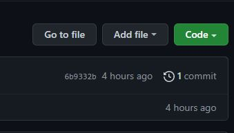
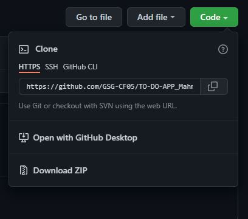
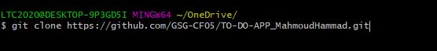

# TO-DO-APP

## Project description:

Create a to-do app to help the user in arranging his daily tasks, where this application is considered as a part of the **GSG coding fundamental course**.

## user stories
* The user should be able to add my to-do to the list and save it in local storage.
* The user should be able to edit my to-dos.
* The user should be able to remove any to-do from my list (remove it from local storage).
* The user can still have my list even if I close the browser window.

## Live link
[To-Do App](https://gsg-cf05.github.io/TO-DO-APP_MahmoudHammad/)

## Cloning a repository

1. To navigate the main page of the repository [click here](https://github.com/GSG-CF05/TO-DO-APP_MahmoudHammad).

2. Above the list of files, click Code.
<br />


3. To clone the repository using HTTPS.
<br />


4. Open Git Bash.

5. Change the current working directory to the location where you want the cloned directory.

6. Type ```git clone```, and then paste the URL you copied earlier.
<br />


7. Press **Enter** to create your local clone.
<br />


## created by: [Mahmoud Hammad](https://github.com/mahmoudhammad309)


